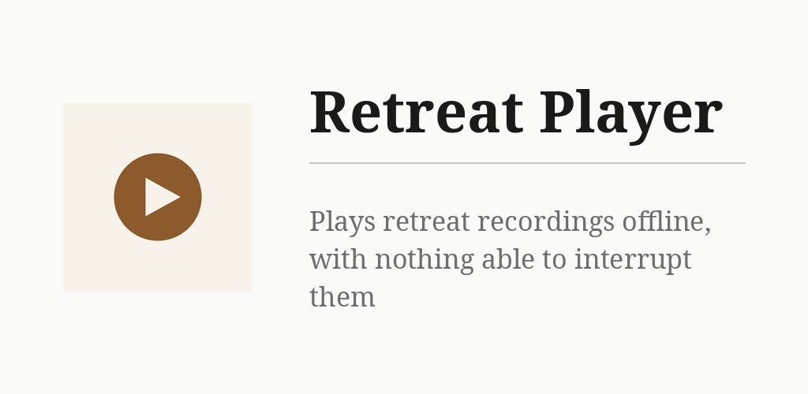

# Retreat Player

Plays talks, bells and chanting for a meditation retreat. Recordings are loaded from the
phone, a public kDrive link or a podcast feed and kept in the app — airplane mode is fine.
Once playback starts, nothing interrupts it; a recording plays once, and nothing follows it.
Sibling of [Retreat Timer](https://github.com/funkypitt/retreat-timer). No ads, no account.

## Key points

- Tap **+** and choose a source: files on this phone, a shared kDrive folder (public
  Infomaniak share link, no password) or a podcast feed. Tick recordings, press **Load**.
- The share link and feed URLs are remembered and pre-filled next time.
- New tiles land under **Just loaded**; file each into **Bells & chanting** (kept on
  top) or **Dharma talks** with the ⋮ menu, and order them with the ▲ ▼ arrows.
- Tap a tile to play. The player shows elapsed and remaining time, with play/pause,
  stop, ±10 s and back to the beginning.
- While a recording plays the screen stays on, and playback goes on with the screen off.
  The app takes no audio focus, so nothing else on the phone can duck or pause a talk.
- The network is used only while loading. No tracking.

More detail: [docs/NOTES.md](docs/NOTES.md).

## Install


[](https://gallaz.ch/eink/#retreat-player)

- **F-Droid** (recommended, updates arrive by themselves): add the repository from [gallaz.ch/eink](https://gallaz.ch/eink/#fdroid), or the address `https://funkypitt.github.io/fdroid-repo/repo` in F-Droid.
- **Obtainium**: tap the badge on the phone, or add `https://github.com/funkypitt/retreat-player` in Obtainium.
- **APK**: attached to the [latest release](../../releases/latest). No automatic updates.

All three deliver the same file, with the same signature.

## Build

```
./gradlew assembleDebug
```

## Crédits / Credits

© 2026 Pierre Gallaz. Développé avec [Claude Code](https://claude.com/claude-code) (Anthropic).
Licence MIT, voir `LICENSE`.

© 2026 Pierre Gallaz. Developed with [Claude Code](https://claude.com/claude-code) (Anthropic).
MIT licence, see `LICENSE`.
